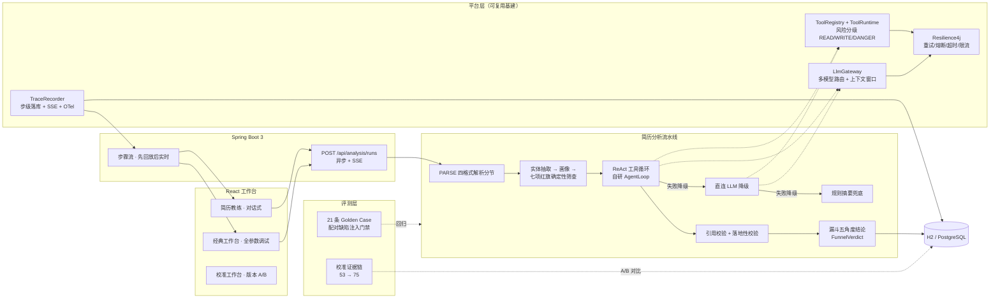

# DocAgent — 简历分析 Agent

上传一份简历（PDF / DOCX / MD / TXT），选择求职方向（默认"AI 应用开发"），Agent 以 **ReAct 工具循环**自主通读全文，产出**漏斗式分析报告**——七项红旗筛查、五角度档位结论（表达 / 内容强度 / 面试杠杆 / 必备项覆盖 / 方向匹配）、词汇差距与可采纳的改进建议；对话中**点采纳生成修改稿**，可继续追问（"空窗期怎么解释"）。报告引用可回跳原文，建议落地性有代码级校验，每一轮优化有评测证据链。

> 面试演示友好：一条命令启动、零外部中间件、LLM 不可用时三级降级保证演示不断线、历史 run 可完整回放审计。

## 90 秒演示剧本

1. `mvn spring-boot:run` 启动（约 3 秒），打开 http://localhost:8020 —— 默认即「简历教练」对话工作台
2. 上传简历（或拖入任意 PDF/DOCX/MD/TXT），方向默认"AI 应用开发"，人群自动识别
3. 点击「开始分析」→ 对话中实时滚动执行链路：**解析 → 实体抽取 → 画像构建 → 红旗筛查 → ReAct 逐节阅读 → 引用校验 → 漏斗报告**
4. 报告卡：红旗项（HIGH 一票否决 / MEDIUM 追问 / LOW 提示）、五角度档位、面试杠杆卡（大概率被问什么 + 准备提示）、方向匹配档位与词汇 diff
5. 改进建议卡点击「采纳」→ 生成 Markdown 修改稿（含锚定失败明细）
6. 底部追问输入框：`空窗期怎么解释` → 对话续跑，不覆写首轮报告
7. 切到「历史」回放任意 run 的步骤树；切到「校准」看不同 promptVersion 的分角度 A/B diff
8. （加分）不配置 API Key 重启 → RULE_FALLBACK 降级，链路与报告依然完整——降级链路兜底

## 架构



**一次 run 的执行链**：`PARSE → ENTITY_EXTRACT（LLM 抽取工作经历/技能/教育，失败降级显式标记）→ PROFILE_BUILD（纯代码画像：年限/时间线/技能矩阵）→ RED_FLAG_CHECK（七项确定性检查，与 LLM 判断分离）→ REACT_ANALYZE（自研 AgentLoop：get_document_outline / read_section / search_document 自主迭代，预算内不限死轮次）→ [降级] DIRECT_LLM（携带循环已读片段，降级不丢上下文）→ [兜底] RULE_FALLBACK → CITATION_VERIFY（编造引用剔除、错位重挂）→ 漏斗五角度结论 + 评价专调`，每步落库 `agent_step` 并推送 SSE；循环每轮写 `agent_checkpoint`，崩溃重启后自动续跑。

## 核心特性

| 特性 | 说明 |
|---|---|
| 漏斗式结论（非加权总分） | 五角度各出档位：表达质量 / 内容强度（逐条 STAR、结果影响范围、归因清晰度）/ 面试杠杆卡（大概率问题 + 准备提示 + 应对策略）/ 必备项覆盖率 / 方向匹配档位；红旗层独立于评分，"会死在哪一关"先于"打几分" |
| 七项红旗确定性筛查 | 时间线空窗（含尾部待业与已解释空窗三型分开口径）、频繁跳槽（按人群调阈值）、经历重叠、任期与职级错配、联系方式缺失、关键板块缺失、量化缺失——纯代码判定，确定性可评测；HIGH 一票否决、MEDIUM 触发追问、LOW 提示 |
| 方向画像与词汇 diff | 匹配模式支持具体 JD 与"方向画像"（广撒网场景：匹配对象从一份 JD 换成要求分布）；画像定义必备项、岗位变体、筛选问题与词汇表，输出匹配档位 + 简历用词与岗位词汇的差距清单 |
| 建议闭环 | 结构化建议（severity / 目标章节 / before / after / 理由）→ 前端点「采纳」→ 弹性锚定替换生成 Markdown 修改稿，幂等，附锚定失败明细 |
| 追问对话 | 分析完成后可继续追问；消息进 checkpoint 重回队列续跑，自由文本不覆写首轮报告 |
| 引用与落地双校验 | 报告引用强制 `{sectionId, quote}`，校验步剔除编造引用、错位自动重挂；建议落地性纯代码不变量——数字必须有出处、before 必须是原文连续片段 |
| 评测驱动校准（53→75） | promptVersion + optimizationNote 记录每轮调整；A/B 端点输出分角度 IMPROVED/REGRESSED diff；校准工作台可视化，证据链防"改好一处坏另一处" |
| 真·ReAct 循环 | **自研 AgentLoop 内核**（LangChain4j 仅作模型传输层）：显式状态机 Thought→Action→Observation，LLM 自主决定读哪些节、搜什么关键词；短文档自动跳过循环直连 |
| Durable 执行 | 每轮 checkpoint 落库（消息+预算+文档快照）；进程被杀后重启自动从断点续跑（LOOP_RESUME 步骤进 trace） |
| 水平扩展（DB 队列） | run 入库排队，多实例 CAS 认领互斥（实测双实例 10 run 分摊 4/6）；超时未推进自动重新入队由任意实例续跑——崩溃自愈从"启动时一次"升级为"持续自愈" |
| 循环预算硬顶 | 轮次/工具调用/token 三重上界，超限是可预期停止原因并进入降级链，失控代价有界 |
| 工具治理 + HITL | 工具统一注册（READ/WRITE/DANGER 风险分级），经 ToolRuntime 执行：Resilience4j 包裹（副作用工具不重试）+ tool_execution_log 审计；DANGER 级 export_report 被 ToolConfirmGate 拦截：run 进入 WAIT_HUMAN_CONFIRM、前端弹确认卡，人工确认后才写盘 |
| 三级降级 | ReAct 失败 → 直连 LLM（单次调用，按模型窗口截断）→ 规则摘要。无 API Key 也能完整演示 |
| Golden Case 评测 | 21 条用例走完整生产链路回归：配对缺陷注入（同简历注入缺陷后必须**严格差于**基线的单调性门禁，防评测放水）+ 13 份语料回归 + 落地性不变量断言；断言与执行模式无关，无 Key 的 CI 与真实环境同一套标准 |
| 全链路 Trace | 每步（含 ReAct 每轮 LLM 响应与每次工具调用）写 agent_step 树形表 + SSE 实时推送 + OTel span；另有 pipeline 阶段条与 LLM 交互全文端点，排障不靠翻日志 |
| 双技能一引擎 | 简历分析与通用文档分析注册为两个 Skill（提示词+工具集+默认指令的差异），共享执行引擎 / 降级链 / trace / 前端 |
| 多格式解析 | PDF（PDFBox，扫描件明确报错）/ DOCX（POI，标题样式分节）/ MD（标题分节）/ TXT（空行聚合），统一分节视图 |
| 一键演示 | 默认 H2 文件库 + 内嵌前端构建产物，克隆后 `mvn spring-boot:run` 即跑（仅需 `LLM_API_KEY` 可选） |

## 快速开始

环境要求：JDK 21+（Node 仅前端开发时需要）。

```bash
# 1.（可选）配置 DashScope API Key——不配也能跑（规则降级模式）
export LLM_API_KEY=sk-xxx        # Windows: set LLM_API_KEY=sk-xxx

# 2. 启动（内嵌前端 + H2，无任何外部依赖）
mvn spring-boot:run

# 3. 打开
http://localhost:8020
```

生产/团队环境切 PostgreSQL：`--spring.profiles.active=pg`（连接参数见 `application-pg.yml`）。模型默认 qwen-plus，`LLM_MODEL` 可换；摘要等简单调用自动路由 qwen-turbo。

### 前端开发模式

```bash
cd frontend
pnpm install
pnpm dev          # Vite 5173，代理 /api 到 8020，热更新
pnpm build        # 产物直出 ../src/main/resources/static
```

## API 一览

| 方法 | 路径 | 说明 |
|---|---|---|
| POST | `/api/analysis/runs` | multipart（file + instruction / skill / 方向或 JD / 人群 / promptVersion），202 返回 runId，异步执行 |
| GET | `/api/analysis/runs` | 历史列表 |
| GET | `/api/analysis/runs/{id}` | 详情（状态 + 结构化结果 + 待确认动作） |
| GET | `/api/analysis/runs/{id}/stream` | SSE 步骤流（连接即回放已落库步骤，支持刷新） |
| GET | `/api/analysis/runs/{id}/document` | 文档分节视图（引用定位） |
| POST | `/api/analysis/runs/{id}/messages` | 追问对话 |
| GET | `/api/analysis/runs/{id}/messages` | 消息回放 |
| POST | `/api/analysis/runs/{id}/apply-suggestions` | 采纳建议 → Markdown 修改稿 |
| GET | `/api/analysis/runs/{id}/pipeline` | 阶段状态条 + LLM 调用聚合（链路诊断） |
| GET | `/api/analysis/runs/{id}/interactions` | 全部 LLM 交互含 prompt/响应全文 |
| GET | `/api/analysis/optimization-history` | 按 promptVersion 的优化历史 |
| GET | `/api/analysis/optimization-compare` | 两版本分角度 diff（IMPROVED / REGRESSED） |
| GET | `/api/audit/agent-runs/{id}` | 步骤树审计（parentStepId / 耗时 / 工具 / LLM） |
| GET | `/api/audit/agent-runs/{id}/llm-stats` | LLM 调用统计 |
| GET | `/api/human/pending` | 待人工确认动作 |
| POST | `/api/human/actions/{id}/confirm`、`/reject` | 确认/拒绝 DANGER 工具操作 |
| GET / POST | `/api/evals/cases`、`/api/evals/run` | Golden Case 清单 / 全量评测 |
| GET | `/api/evals/reports`、`/api/evals/compare` | 评测报告 / 两版本回归对比 |

## 评测与校准

**21 条 Golden Case**（`src/main/resources/eval/golden-cases.json`）：

- 2 条通用文档分析 legacy + 1 条简历基础断言
- 4 条**漏斗配对缺陷注入**：同一简历注入空窗 / 内容强度缺陷 / 词汇缺失，`expectWorseThan: funnel-base` 要求缺陷版**严格差于**基线——评测防放水的单调性门禁（基线跑 3 次取中位数控方差）
- 1 条 JD 匹配缺陷注入 + 13 条语料回归用例（覆盖中文日期、正常交接不误报、尾部待业、混乱排版压分等）
- 全部语料用例断言 `maxGroundingFindings: 0`（落地性反编造不变量）

**空窗口径**由 6 条用例锁定：当月计数修正、尾部雇佣、教育兜底、已解释空窗三型分开口径——修一个口径不许弄坏另一个。

**三层防线**：确定性不变量（落地校验）→ 语料回归（真实简历脱敏入评测）→ 回填协议（线上逃逸的问题 → 脱敏入语料 → 加断言 → 红 → 修 → 绿）。

**校准闭环 53→75**：golden 化 → 看分定位 → 只改一处 → promptVersion 标注 → optimization-compare 分角度 diff → 全量回归锁。每一分提升有提交、有 A/B 证据，防"改好表达、坏掉匹配"。

## 项目结构

```
src/main/java/com/gcll/docagent/
├── analysis/      # 技能注册表 + 简历分析流水线：实体抽取/画像/红旗/漏斗结论/追问/采纳修改稿/校准服务
├── parsing/       # 四格式解析器 + 统一分节视图（DocumentParser SPI）
├── loop/          # 自研 AgentLoop 执行内核：显式状态机 / checkpoint / 预算
├── langchain4j/   # LangChain4j 传输层装配 + 工具桥接
├── llm/           # LlmGateway：多模型路由、上下文窗口、摘要式记忆、结构化输出
├── tool/          # 工具体系：注册表、风险分级、DANGER 门控（文档工具）
├── platform/tool/ # ToolRuntime：治理包裹 + 审计落库
├── human/         # HITL：待人工确认动作
├── resilience/    # Resilience4j 网关：按调用类型的重试/熔断/超时/限流
├── persistence/   # DB 队列：CAS 认领多实例互斥、自愈扫描、checkpoint 存储
├── eval/          # Golden Case 评测 + 轨迹指标
├── observability/ # TraceRecorder：步级双写（业务表 + OTel）
└── api/           # REST + SSE 控制器
frontend/          # React 18 + TS + Tailwind：简历教练 / 经典工作台 / 历史 / 校准工作台
sample-docs/       # 演示示例：简历 PDF / 需求 DOCX / 技术方案 MD
```

## 面试讲解要点

1. **为什么漏斗档位替代加权总分**：加权总分可被堆砌刷高且不可行动；漏斗按"会死在哪一关"排序——红旗（硬伤）→ 必备项覆盖（门槛）→ 内容强度与表达（区分度）→ 方向匹配（命中率），每层结论可独立验证、独立行动。
2. **确定性红旗与 LLM 判断的分工**：空窗、跳槽、重叠等事实判断交给纯代码七项检查（确定、可单测、口径可锁定），表达质量、STAR 完整度等模糊判断交给 LLM——LLM 只做它擅长的事，输出才敢引用。
3. **评测怎么防放水**：配对缺陷注入——同一简历注入缺陷后必须严格差于基线（单调性门禁），加上"纯描述式输出直接判红"的契约断言和 13 份语料回归，改提示词刷不过评测。
4. **53→75 的证据链**：不是调一次提示词的运气——golden 化、看分定位、只改一处、promptVersion 标注、分角度 A/B diff、全量回归锁，防"改好一处坏另一处"。
5. **为什么自研循环而不用框架的 AiService**：框架循环给不了三样东西——崩溃恢复（每轮 checkpoint + 重启续跑）、预算硬顶（轮次/工具/token 可预期停止）、降级不丢上下文（已读片段随结果带出给直连 LLM 复用）。LangChain4j 退为纯传输层。
6. **为什么 DB 队列而不是消息中间件**：run 的状态本来就在库里，CAS 认领把"队列"也放进同一存储，免维护 Kafka/Redis；多实例互斥、崩溃自愈、断点续跑全部由 SQL 语义保证——量级判断，单机到中小规模够用。
7. **双框架分工**：流程化调用（抽取、评价专调、降级路径）走 Spring AI Alibaba（DashScope）；ReAct 传输层用 LangChain4j 的 OpenAI 兼容接入——同一模型两种协议，职责分离互不干扰。
8. **空窗口径这种"小问题"为什么值得修三轮**：当月计数、尾部雇佣、教育兜底——每一处都是真实简历暴露的误报，修完由 6 条 golden case 锁死；口径问题不修，红旗层就不可信，整个漏斗失去地基。

## 压测与成本

**以下为通用文档分析技能阶段实测（平台层能力与技能无关，仍然适用）；简历技能新增实体抽取与评价专调等多次 LLM 调用，延迟结构不同。**

| 指标 | 数值（单实例 / 3 worker / qwen-plus） |
|---|---|
| 并发批次 8 run（同文档） | 8/8 完成，全部 REACT 模式 |
| 端到端延迟（提交→完成，含排队） | P50 63.8s（单 run 纯执行约 21s） |
| 吞吐 | 7.5 run/分钟 |
| token | 均值 3.8k/run |
| 单次分析成本 | ≈ ¥0.004 |

并发压力实战：提示词与工具集曾出现不一致导致 9/12 run 循环降级直连——但 **12/12 全部完成、零失败**（三级降级链兜底），该案例同时暴露并修复了"提示词-工具集一致性"问题。

多实例与自愈实测：双实例 CAS 分摊 4/6；杀掉正在执行的实例后，存活实例经自愈扫描重新入队并从 checkpoint 第 2 轮续跑（LOOP_RESUME，resumedBy 可追溯），最终 REACT 模式完成。

## 测试

140+ 个自动化测试（29 个测试类）：四格式解析（PDF/DOCX fixture 测试内生成）、红旗七项检查、落地性不变量、实体规范化与日期解析、工具治理与 DANGER 门控、Resilience4j 故障注入、Golden Case 回归，以及覆盖「LLM 正常 / LLM 失败降级 / 非法文件拒收」三场景的端到端集成测试（@MockitoBean 替换 LLM 网关，无 Key 全量验证）。

```bash
mvn test
```
